# ResolveAI

**Turn your documentation into instant answers.** ResolveAI is a customer-support
answer engine: you give it your help articles, and it answers questions from them
through an embeddable chat widget and a developer API. Each answer lists the
articles it came from. When the articles don't cover a question, ResolveAI says so
and logs the question as *unresolved*.

It runs **without an AI key**. The default `mock` provider builds its answers from
sentences in your articles, so the whole pipeline works offline and costs nothing:
retrieval, the unresolved gate, citations, the widget and the API. To use a real
model, set `AI_PROVIDER=openai`. Any OpenAI-compatible endpoint works.

> Portfolio project. The demo content describes **Northwind Cloud**, a product that
> doesn't exist. The pricing on the landing page is illustrative, and nothing is
> billed.

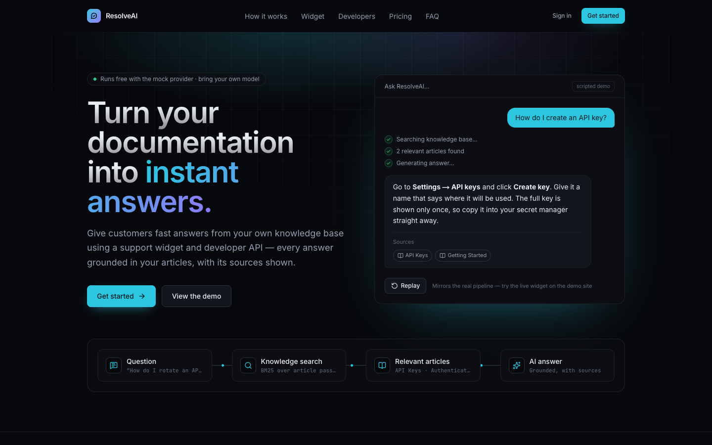

| Knowledge base with the test chat | Widget on a customer's site |
| --- | --- |
| 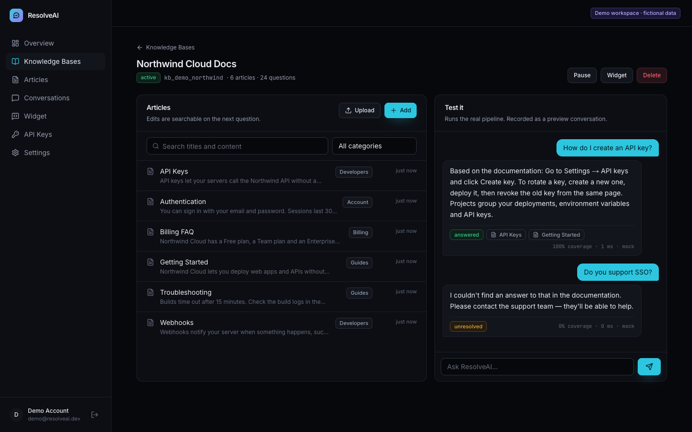 | 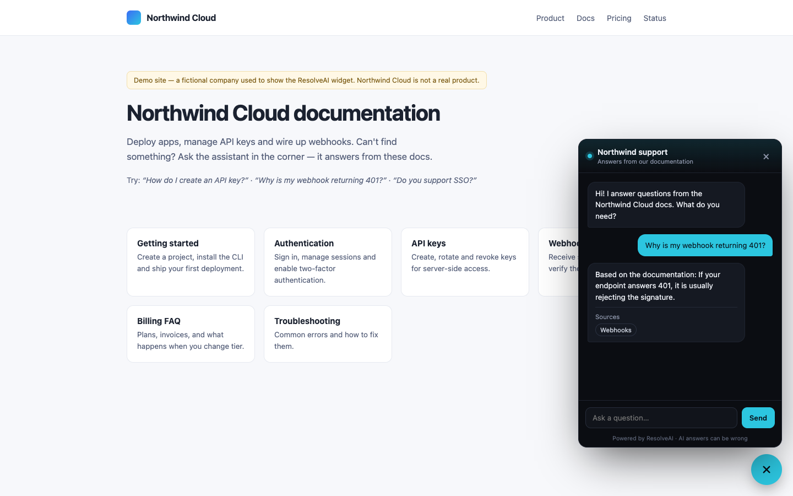 |
| **Overview** | **Unresolved questions** |
| 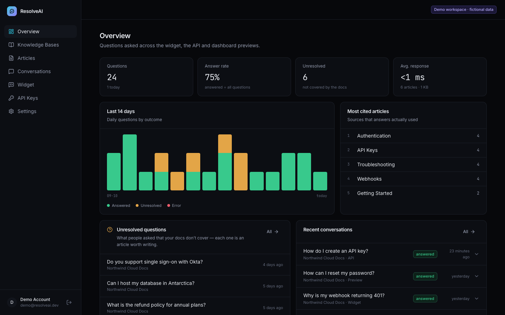 | 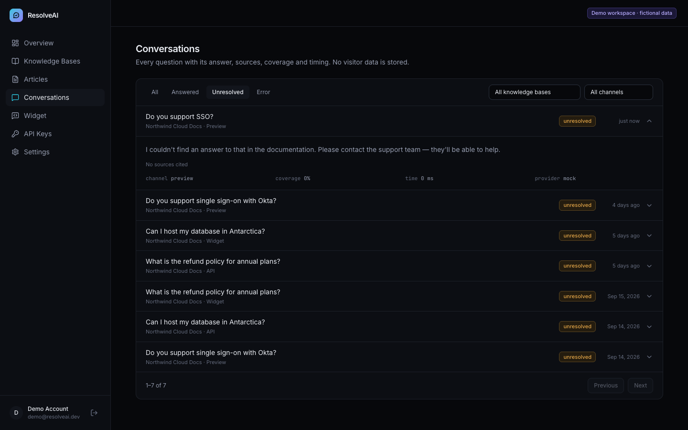 |
| **Widget settings** | **API keys (shown once)** |
| 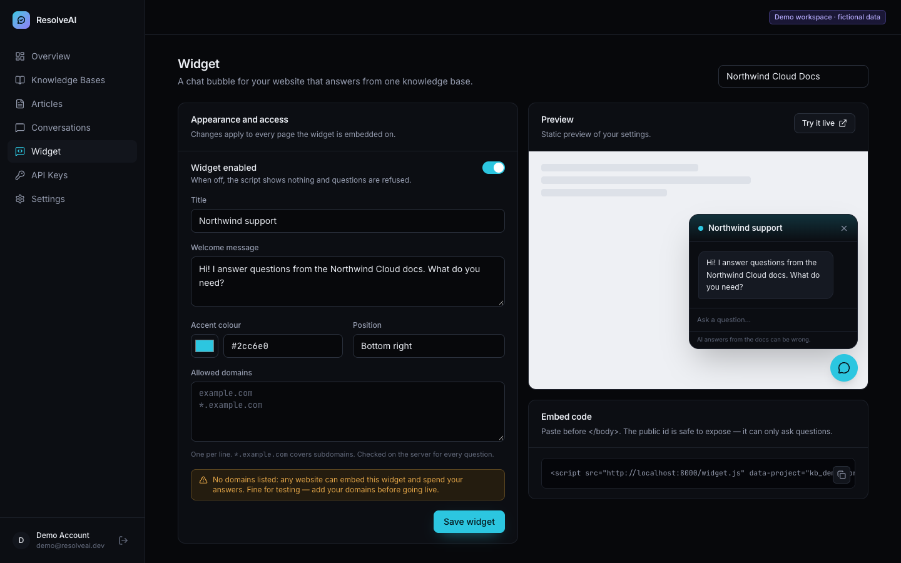 | 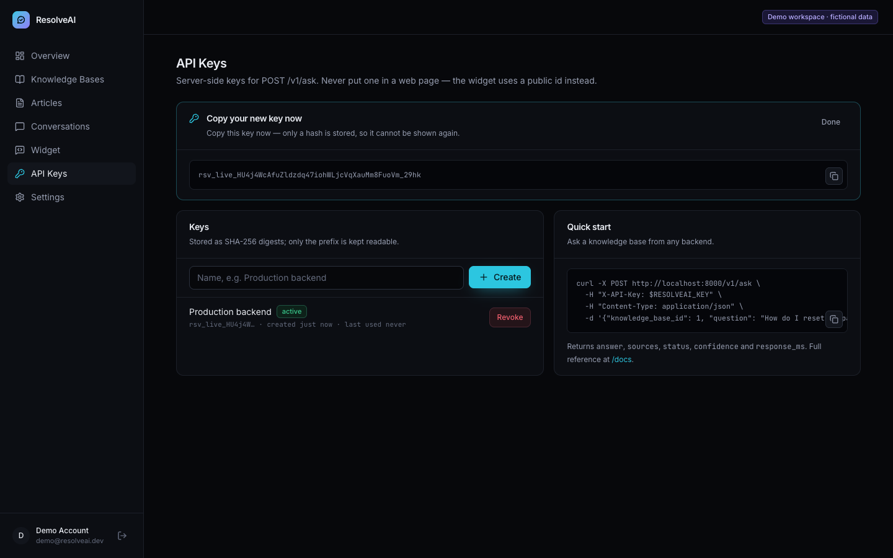 |

---

## Contents

- [Features](#features)
- [Architecture](#architecture)
- [How an answer is produced](#how-an-answer-is-produced)
- [AI providers](#ai-providers)
- [The widget](#the-widget)
- [Developer API](#developer-api)
- [Getting started](#getting-started)
- [Configuration](#configuration)
- [Security](#security)
- [Testing](#testing)
- [Deployment](#deployment)
- [Limitations and honest notes](#limitations-and-honest-notes)

## Features

- **Knowledge bases and articles.** Write articles in Markdown, or upload `.md`
  and `.txt` files; a file's first heading becomes its title. Articles have
  categories and can be searched. The retrieval index reflects every edit on the
  next question, with no re-indexing job.
- **Grounded answers with verified sources.** Only the passages retrieved for a
  question reach the provider. A citation counts only if its article was actually
  retrieved.
- **Unresolved questions.** If retrieval doesn't cover a question well enough,
  the model is never called. The visitor gets a plain "I couldn't find that", and
  the question goes on the dashboard's list of articles to write.
- **Embeddable widget.** One `<script>` tag with no dependencies, rendered inside
  a Shadow DOM. You can set its title, welcome message, accent colour and
  position. The server enforces the allowed-domains list, and requests are
  rate-limited per visitor and per knowledge base.
- **Developer API.** `POST /v1/ask` takes an `X-API-Key` header. Keys are
  SHA-256 hashed at rest, shown once, and can be revoked.
- **Dashboard.** Pages for the overview (14-day chart, answer rate, most-cited
  articles), knowledge bases, articles, conversation history with filters,
  widget settings with a preview, API keys and settings.
- **Pluggable AI.** Choose `mock` or `openai` with one environment variable,
  behind a small provider protocol.

## Architecture

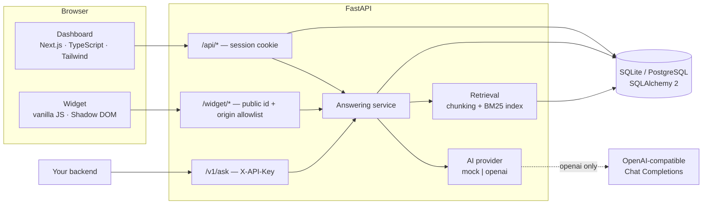

| Layer | Choices |
| --- | --- |
| API | FastAPI, Pydantic v2, SQLAlchemy 2 (typed models), one JSON error envelope `{"error": {"code", "message"}}` |
| Storage | SQLite in WAL mode by default; PostgreSQL via `DATABASE_URL` |
| Auth | scrypt password hashes, JWT in an HttpOnly cookie, SHA-256 API-key digests |
| Retrieval | Heading-aware chunking, BM25 with title and heading terms weighted ×2, in-process cache invalidated by article changes |
| AI | `AIProvider` protocol, with an extractive `MockProvider` and an `OpenAIProvider` (httpx and JSON-schema structured output) |
| Web | Next.js (App Router), React 19, Tailwind CSS v4, Motion, lucide icons |
| Widget | About 11 KB of dependency-free JavaScript, served by the API at `/widget.js` |

```
backend/
  app/
    ai/            provider protocol, prompt, mock + OpenAI providers, factory
    retrieval/     tokenizer/stemmer, chunking, BM25, per-KB index cache
    services/      answering pipeline, analytics, origin allowlist
    api/routes/    auth, knowledge, conversations, widget, developer, system
    models/        SQLAlchemy models
    schemas/       Pydantic request/response models
    seed.py        demo account + fictional knowledge base
  widget/          resolveai-widget.js and the demo host page
  tests/
frontend/
  src/app/         landing page, auth, dashboard routes under /app
  src/components/  site sections, dashboard pieces, UI primitives
```

## How an answer is produced

The widget, the API and the dashboard's test chat all call the same
`answer_question()` function.

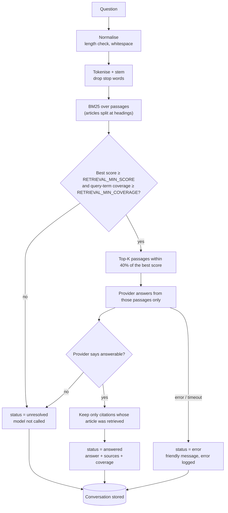

Two design decisions need explaining:

- **The gate uses coverage as well as score.** BM25 scores aren't comparable
  between questions. A question that shares one rare word with an article, such
  as "refund" in *"What is the refund policy for annual plans?"*, can still score
  well. The gate therefore also requires that the best passages contain at least
  half of the question's distinct content terms. The "confidence" shown in the
  dashboard is this coverage figure. It measures how much of the question the
  documentation matched. It is **not** a probability that the answer is correct.
- **Citations are checked, not trusted.** The provider returns the article ids it
  used. Any id that wasn't among the retrieved passages is dropped, so a model
  can't cite an article it never saw.

## AI providers

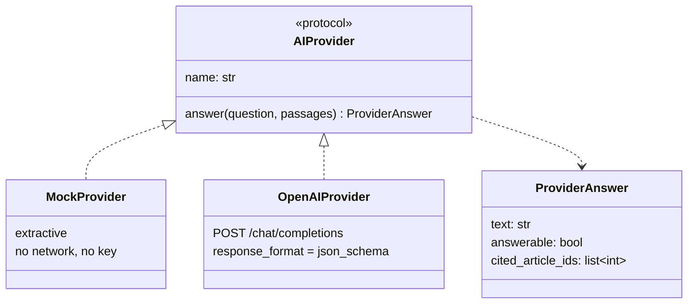

**Mock mode (default).** The mock provider ranks the sentences in the retrieved
passages by overlap with the question. It returns up to three whole sentences
with Markdown stripped, prefixed with *"Based on the documentation:"*. It never
writes anything that isn't in your articles, which makes it predictable for
demos and tests. It can't rephrase or combine facts the way a language model can.

**Real AI mode.**

```bash
AI_PROVIDER=openai
OPENAI_API_KEY=sk-...
OPENAI_MODEL=gpt-4o-mini                      # any chat model
OPENAI_BASE_URL=https://api.openai.com/v1     # or any OpenAI-compatible server
```

The prompt keeps the rules in the system message and the documentation plus
question in the user message. Each passage is wrapped in
`<<<ARTICLE id=… title="…">>> … <<<END ARTICLE>>>`, and any marker text inside an
article is removed first so the article can't close its own block. The model
must reply in a strict JSON schema (`answer`, `answerable`,
`cited_article_ids`). The server refuses to start with `AI_PROVIDER=openai` and
no key.

To add a provider, implement `answer()`, return a `ProviderAnswer`, and register
the provider in `app/ai/factory.py`.

## The widget

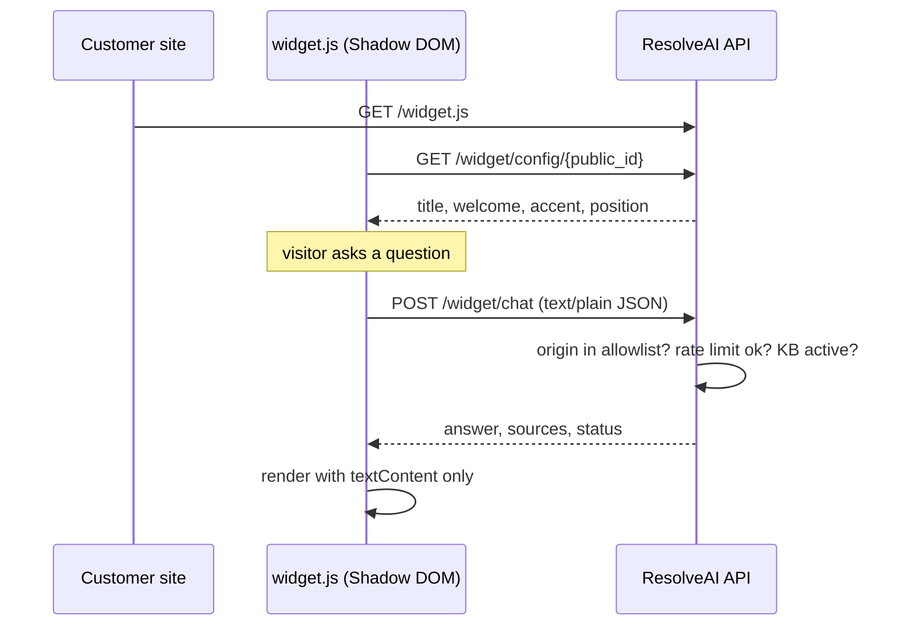

```html
<script src="https://api.your-domain.com/widget.js"
        data-project="kb_xxxxxxxx" async></script>
```

- The page only ever holds the knowledge base's **public id**, which can ask
  questions and nothing else. API keys never belong in a web page.
- **Allowed domains** are checked in the handler on every request, and
  `*.example.com` covers subdomains. CORS is layered on top so that allowed
  sites' browsers can read the response. CORS alone wouldn't be enough, because
  it only protects browsers and a script can ignore it. An empty list means any
  site may embed the widget, and the dashboard shows a warning when that's the
  case.
- Questions are posted as `text/plain` JSON. That keeps them "simple" CORS
  requests, with no preflight round trip. The body is still validated against a
  Pydantic schema.
- The widget renders answers with `textContent` only, never `innerHTML`, so
  article or model output can't inject markup into the host page.
- The panel goes full-screen on phones, closes with Esc, and respects
  `prefers-reduced-motion`.

To try it, run the API and open <http://localhost:8000/demo-site>. It's a
fictional Northwind Cloud docs page with the widget embedded, and
`?project=kb_…` points it at your own knowledge base.

## Developer API

```bash
curl -X POST http://localhost:8000/v1/ask \
  -H "X-API-Key: $RESOLVEAI_KEY" \
  -H "Content-Type: application/json" \
  -d '{"knowledge_base_id": 1, "question": "How do I rotate an API key?"}'
```

```json
{
  "answer": "Based on the documentation: To rotate a key, create a new one, deploy it, then revoke the old key from the same page.",
  "sources": [{ "id": 3, "title": "API Keys", "score": 5.12 }],
  "status": "answered",
  "confidence": 1.0,
  "response_ms": 2,
  "conversation_id": 42,
  "provider": "mock"
}
```

`status` is `answered`, `unresolved` or `error`. Errors always use the same
envelope, `{"error": {"code": "invalid_api_key", "message": "…"}}`. The
interactive OpenAPI reference is at `/docs`.

| Endpoint | Auth | Purpose |
| --- | --- | --- |
| `POST /v1/ask` | `X-API-Key` | Ask a knowledge base from your server |
| `GET /widget.js`, `GET /widget/config/{id}`, `POST /widget/chat` | public id + origin | Embedded widget |
| `/api/auth/*`, `/api/me` | — / cookie | Register, sign in, sign out |
| `/api/knowledge-bases`, `/api/articles`, `…/upload` | cookie | Knowledge bases and articles |
| `/api/chat`, `/api/conversations`, `/api/unresolved`, `/api/overview` | cookie | Test chat, history, analytics |
| `/api/knowledge-bases/{id}/widget` | cookie | Widget settings and embed code |
| `/api/keys` | cookie | Create, revoke and delete API keys |
| `GET /api/health` | — | Liveness, database, provider |

## Getting started

Requirements: Python 3.12+ and Node 20+.

```bash
make install        # backend venv + requirements, frontend npm install
cp .env.example backend/.env
cp frontend/.env.example frontend/.env.local
make seed           # demo account + fictional "Northwind Cloud Docs"
make api            # http://localhost:8000  (also /widget.js and /demo-site)
make web            # http://localhost:3000
```

Without `make`:

```bash
cd backend
python3 -m venv .venv && .venv/bin/pip install -r requirements-dev.txt
.venv/bin/python -m app.seed --reset
.venv/bin/uvicorn app.main:app --port 8000

cd ../frontend
npm install && npm run dev
```

Sign in with **demo@resolveai.dev** / **resolveai-demo-1234**, or open
<http://localhost:3000/login?demo=1>, which fills them in. The seed runs twelve
real questions through the pipeline twice. Nine are answered. Three are
unresolved on purpose: SSO with Okta, hosting in Antarctica, and a refund policy
the docs don't mention. Only their timestamps are back-dated, so the 14-day chart
has some history.

## Configuration

All settings are environment variables; see [`.env.example`](.env.example).

| Variable | Default | Meaning |
| --- | --- | --- |
| `ENVIRONMENT` | `development` | `production` enforces a strong `SECRET_KEY` and `COOKIE_SECURE=true` |
| `APP_URL` | `http://localhost:3000` | Dashboard origin, the only one CORS allows for `/api` |
| `PUBLIC_API_URL` | `http://localhost:8000` | Used in the generated embed code |
| `DATABASE_URL` | `sqlite:///./resolveai.db` | For PostgreSQL, `postgresql+psycopg://…` (install `psycopg[binary]`) |
| `SECRET_KEY` | — | Signs session tokens |
| `ACCESS_TOKEN_TTL_MINUTES` | `720` | Session lifetime |
| `COOKIE_SECURE` / `COOKIE_SAMESITE` | `false` / `lax` | Session cookie flags |
| `ALLOW_REGISTRATION` | `true` | Turn off public sign-up |
| `AI_PROVIDER` | `mock` | `mock` or `openai` |
| `OPENAI_API_KEY` / `OPENAI_MODEL` / `OPENAI_BASE_URL` | — / `gpt-4o-mini` / OpenAI | Real-model settings |
| `AI_TIMEOUT_SECONDS` / `AI_MAX_OUTPUT_TOKENS` | `30` / `500` | Provider limits |
| `RETRIEVAL_TOP_K` | `4` | Passages sent to the provider |
| `RETRIEVAL_MIN_SCORE` | `1.2` | Minimum BM25 score of the best passage |
| `RETRIEVAL_MIN_COVERAGE` | `0.5` | Minimum share of question terms found |
| `MAX_QUESTION_CHARS` / `MAX_ARTICLE_CHARS` | `500` / `50000` | Input limits |
| `WIDGET_RATE_PER_MINUTE` | `20` | Per visitor; each knowledge base allows 20× that |

The web app reads `NEXT_PUBLIC_API_URL` and `NEXT_PUBLIC_SITE_URL` from
`frontend/.env.local`.

## Security

- **Passwords** are hashed with scrypt, using `maxmem` set explicitly so the
  default 32 MiB cap doesn't fail. Sign-in and registration are rate-limited.
- **Sessions** are JWTs in an `HttpOnly` cookie, so page scripts can't read
  them. `/api` only accepts CORS from `APP_URL`.
- **API keys** are 256-bit random keys with a `rsv_live_` prefix. Only a
  SHA-256 digest and a short prefix are stored. A key is shown once, and revoking
  it takes effect on the next request.
- **Ownership** is checked on every object. Another user's knowledge base,
  article or conversation returns `404`, not `403`, so ids can't be probed.
- **Widget abuse controls** are the server-side origin allowlist, per-visitor
  and per-knowledge-base rate limits, a body-size limit, question length limits,
  and pausing a knowledge base or disabling its widget.
- **Prompt injection.** Rules sit in the system message. Articles are delimited,
  with delimiter text stripped from their content, and treated as reference
  material. The output schema is strict, and citations are checked against the
  retrieved ids. This lowers the risk but doesn't remove it; see the limitations
  below.
- **Privacy.** Conversations store the question, answer, sources, coverage,
  timing and provider. Visitor IPs are only used in memory for rate limiting,
  and no user agents or cookies are stored.
- **Uploads** accept only `.md`/`.txt`, up to 512 KB, and must be valid UTF-8.

## Testing

```bash
make test        # or: cd backend && .venv/bin/python -m pytest
```

The suite runs 41 tests against a temporary database, with no network:

- `test_answering.py` covers the tokenizer and stemmer, chunking, BM25 ranking,
  the coverage gate, and the mock provider's sentence choice. It checks that an
  edited article is searchable straight away and that citations the model
  invents are dropped. It runs the OpenAI provider against a fake transport and
  checks structured-output parsing. It checks that a provider failure, such as a
  timeout, becomes `error` and not a 500, that article text can't forge a prompt
  delimiter, and that excerpts come out as plain text.
- `test_auth_and_ownership.py` covers registration, sign-in and sign-out,
  password rules, session-only routes, and another account's objects returning
  404.
- `test_widget_and_api.py` covers widget config and chat, the origin allowlist
  (403 for other sites), per-visitor rate limits, disabled and paused knowledge
  bases, API key creation, hashing and revocation, and `/v1/ask`.

CI (GitHub Actions) runs the backend tests, and `lint` plus a production `build`
of the web app.

## Deployment

- **API:** any host that runs `uvicorn app.main:app` (Render, Fly.io, Railway, a
  VM). Set `ENVIRONMENT=production`, a long `SECRET_KEY`, `COOKIE_SECURE=true`,
  `APP_URL` and `PUBLIC_API_URL`. Use PostgreSQL for anything shared.
- **Dashboard:** Vercel or any Node host. Set `NEXT_PUBLIC_API_URL`.
- If the dashboard and API are on different sites, serve them under one parent
  domain (`app.example.com` / `api.example.com`) so the session cookie stays
  first-party. Otherwise use `COOKIE_SAMESITE=none` together with `COOKIE_SECURE=true`.
- Rate limits and the retrieval cache live in process memory. With more than one
  API worker, move rate limiting to Redis. The cache rebuilds itself per process.

## Limitations and honest notes

- **Answers can be wrong.** Grounding and citation checks reduce invented
  answers, but a language model can still misread or over-generalise a passage.
  This project makes no claim about accuracy. The widget tells visitors that AI
  answers can be wrong, and every answer shows its sources so they can be checked.
- **Keyword retrieval.** BM25 matches words, not meaning. A question that uses
  different vocabulary from the docs ("sign-in" vs "log in") can come back
  unresolved even though the answer exists. The `Retriever` protocol is the place
  to add embeddings (for example pgvector) or hybrid search.
- **The mock provider is extractive.** It quotes sentences and doesn't
  synthesise. Use a real model for fluent answers.
- **Single-turn.** Each question is answered on its own, with no conversation
  memory.
- **In-memory rate limits** reset on restart and aren't shared between workers.
- **Coverage is not confidence.** The percentage in the dashboard shows how much
  of the question the docs matched. It says nothing about whether the answer is
  correct.

## License

MIT © Moeijiro
